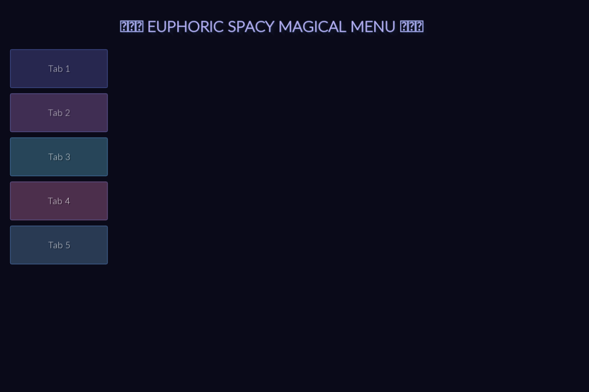
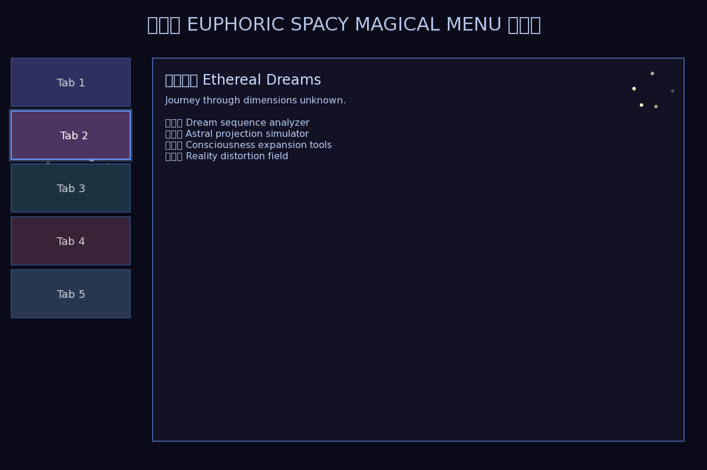

# ✨ Euphoria - Spacy Magical Menu ✨

An extremely good and clean euphoric spacy magical menu application written in C++.

## Screenshots

### Initial State


### Tab Activated


## Features

- **Floating Clickable Tabs**: 5 beautiful tabs positioned on the left side of the screen
- **Magical Visual Effects**: 
  - Particle system with physics
  - Animated gradients and color waves
  - Glow effects on hover
  - Twinkling star background
- **Interactive Elements**: Click tabs to reveal different features
- **Euphoric Aesthetics**: Space-themed color palette with smooth animations

## Prerequisites

- CMake (version 3.10 or higher)
- C++ compiler with C++17 support (GCC, Clang, or MSVC)
- SFML 2.5 or higher (Simple and Fast Multimedia Library)

### Installing SFML

**Ubuntu/Debian:**
```bash
sudo apt-get update
sudo apt-get install libsfml-dev
```

**macOS (with Homebrew):**
```bash
brew install sfml
```

**Arch Linux:**
```bash
sudo pacman -S sfml
```

**Windows:**
Download from [SFML website](https://www.sfml-dev.org/download.php) and follow installation instructions.

## Building

```bash
# Create build directory
mkdir build
cd build

# Configure with CMake
cmake ..

# Build
cmake --build .
```

## Running

```bash
# From the build directory
./euphoria_menu
```

## Usage

1. **Hover over tabs** on the left side to see glow effects and animations
2. **Click on any tab** to activate it and reveal its features
3. **Watch the particle effects** that appear when you click
4. **Enjoy the ambiance** of the twinkling stars and animated colors

## Tab Features

Each tab reveals different cosmic features:

- **Tab 1 - Cosmic Harmony**: Stellar resonance patterns and quantum visualizers
- **Tab 2 - Ethereal Dreams**: Dream analyzers and astral projection tools
- **Tab 3 - Celestial Wonders**: Black hole observations and cosmic phenomena
- **Tab 4 - Quantum Magic**: Probability manipulators and quantum tools
- **Tab 5 - Mystic Portal**: Interdimensional gateways and timeline browsers

## Technical Details

- Built with SFML for graphics rendering
- Particle system with physics simulation
- Smooth animations using delta time
- Responsive hover and click interactions
- Space-themed color palette with dynamic effects

## License

MIT License